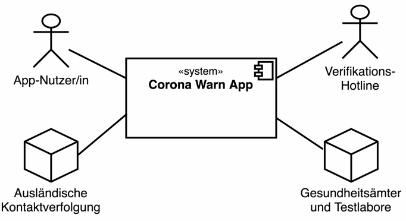

== Diagramme

//plantuml, name, graphviz, smetana

[plantuml]
----
@startuml component
actor "App Nutzer:in" as user
component "Corona App" as app
actor "Verifikations-\nHotline" as hotline
node "Ausländische\nKontaktverfolgung" as kv
node "Gesundheitsämter\nund Testlabore" as labore
user -down-> app
hotline -down-> app
app -down-> kv
app -down-> labore
@enduml
----